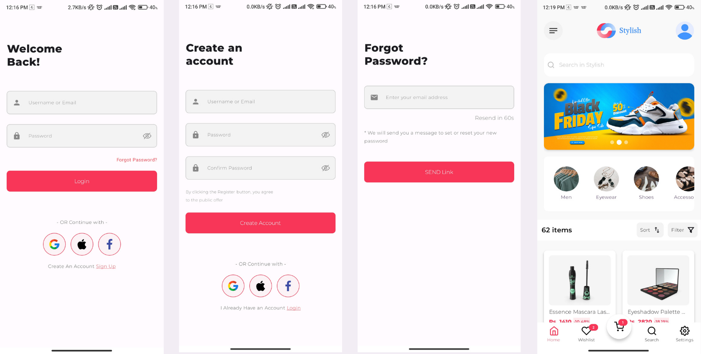
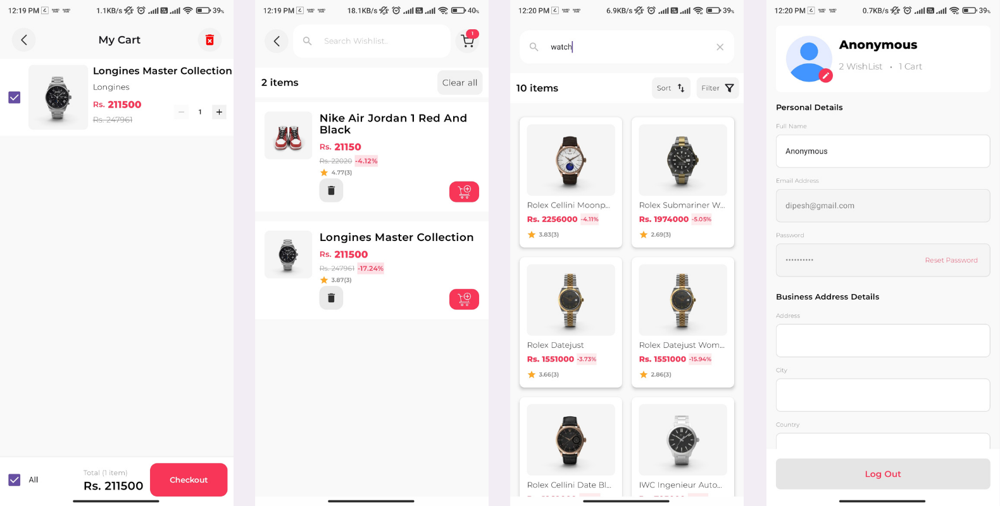

# E-commerce App

A sleek and modern **E-commerce application** built using **Kotlin** and **Jetpack Compose** for Android.  
The app follows **MVVM architecture** and focuses on clean code, state management, and real-world features such as **secure payments using Stripe**.

It includes secure authentication, product browsing, search, sorting, filtering, wishlist, cart management, checkout with Stripe, and user profile features.  
The app integrates **Firebase**, **Firestore**, **Room**, **DataStore**, **Supabase**, and **Stripe** to deliver a complete shopping experience.

---

## Features

### 🔐 Authentication
- **User Registration** using Firebase Authentication
- **User Login** with proper error handling
- **Google Sign-In** support
- **Password Reset** via email
- **Logout** functionality
- **Authentication State Management** to persist login sessions
- **Form Validation** for both login and registration

---

### 🛍 Product Features
- **Product Fetching** from a remote dummy API
- **Search** products
- **Sort** products by price
- **Filter** products by price range and rating
- **Product Details** screen

> A dummy API is intentionally used to focus on UI behavior, state management, and scalable architecture. Switching to a real backend would require minimal changes.

---

### ❤️ Wishlist
- Add/remove products from wishlist
- Wishlist stored locally using **Room Database**
- Offline-friendly wishlist support

---

### 🛒 Cart
- Add/remove items from cart
- Quantity management
- Cart data persisted using **DataStore**
- Cart state survives configuration changes

---

### 💳 Payment (Stripe Integration)
- Secure checkout using **Stripe Payment Gateway**
- Payment flow integrated with cart
- Handles payment success, failure, and cancellation
- Uses Stripe test environment for safe transactions

This demonstrates real-world payment handling and secure transaction flow in Android apps.

---

### 👤 Profile
- User data stored in **Firestore** after registration
- Select profile image from gallery
- Upload profile picture to **Supabase Storage**
- Profile image URL stored in Firestore
- Profile screen displays user info and profile photo

---

## Tech Stack

- **Programming Language**: Kotlin
- **UI Framework**: Jetpack Compose (Material 3)
- **Architecture**: MVVM
- **Dependency Injection**: Hilt
- **Authentication**: Firebase Authentication
- **Database**: Firestore, Room
- **Local Storage**: DataStore
- **Storage**: Supabase
- **Networking**: Ktor
- **Payment Gateway**: Stripe

---

## App Screenshots







## Future Improvements

- Order History & Tracking
- Push Notifications

---

## Setup Steps

1. Clone this repository:

   ```bash
   git clone https://github.com/dipeshmhrzn/ecommerce-app.git

2. Open the project in **Android Studio**.
3. Add your Firebase configuration:
   - Download your **google-services.json** file from the Firebase Console.
   - Place it in the **app/** directory of your project.
4. Enable Google Sign-In in Firebase:
   - Firebase Console → Authentication → Sign-in methods → Google.
5. Add your Supabase configuration (URL + ANON key) in the project.
6. Sync the project with Gradle.
7. Build and run the app on an emulator or Android device.
